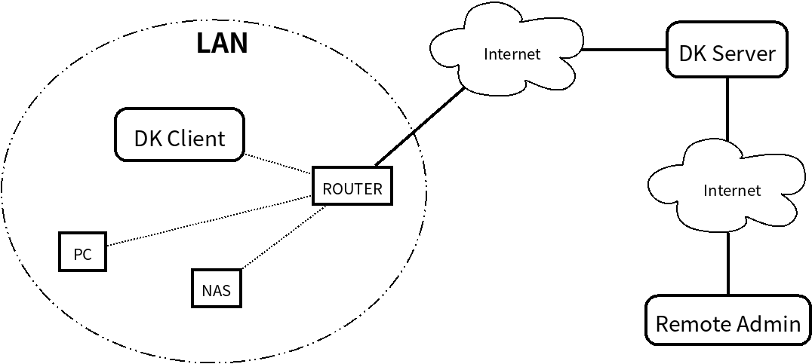

# DoorKeeper系统设计

## 概述

DoorKeeper（下称DK）是一个内网穿透系统，其目的是提供一个可控、安全的方式将内网主机暴露在公网上。与其他内网穿透系统例如[FRP](https://github.com/fatedier/frp)相比，DK的设计目标很单一，就是为家庭网络提供远程支持通道。亦即，对于一个指定的后端，DK只能同时提供**限定个数**的外网访问，而对于访问目标的**动态配置**，则提供了远比FRP等系统更灵活的手段。

## 系统架构

 

  

如上图所示DK系统的三个主要角色是： **DK Client（DKC）** 为系统“后端”服务提供者； **DK Server（DKS）** 是“反向代理”服务器，访问它的流量将被转发到后端；**Remote Admin**是最终使用者终端。

## 概念定义

- **工作端口**：用于流量转发的端口，使用TCP协议
- **管理端口**：用于管理的端口，使用HTTP/HTTPS协议
- **注册服务**：提供后端服务的来源IP地址（即DKC的外网IP)
- **注册客户**：需要访问后端服务的来源IP地址(即Remote Admin的外网IP)

## DKC工作流程

### 主控连接

DKC在启动后即发起TCP连接至DKS的**工作端口**。连接创建后主动按照**握手协议**向DKS表明身份，然后进入等待状态。该连接称为“主控连接”。“握手协议”使用HMAC-SHA256算法。

### 工作连接

当DKS收到连向该DKC的请求后，通过主控连接发送控制信息（包括客户端需要连接的局域网IP地址和端口等）给DKC。主控连接变为工作连接。后续该连接与DKS之间只进行流量转发。工作连接使用TCP信道复用，在流量上添加连接标识，以允许客户端与后端服务之间创建任意多个TCP连接。

### 连接数控制

DKC在主控连接变为工作连接后，立即再发起一个TCP连接给DKS，创建新的主控连接。DKC允许创建的工作连接个数是一个配置选项，达到上限后DKC不再创建主控连接。当工作连接在关闭以后，DKC可以发起新的主控连接。

## DKS工作流程

### 工作端口

DKS在工作端口收到TCP连接后判断是否来自一个注册客户，若是，启动流量转发服务；否则，等待握手包。若在超时之前收到握手，则将连接对端记录为服务端（注册服务），否则，关闭连接。

### 控制端口

控制端口使用HTTP/HTTPS协议。主要有以下命令/功能：

- 将来源IP注册为客户端
- 扫描局域网内开放某个特定端口的主机
- 列出指定DKC的当前连接情况
- 控制DKC的现存连接

以上命令均使用OTP方式提供安全保障。另外，使用HTTPS和预定义命令可以进一步提高安全性。
